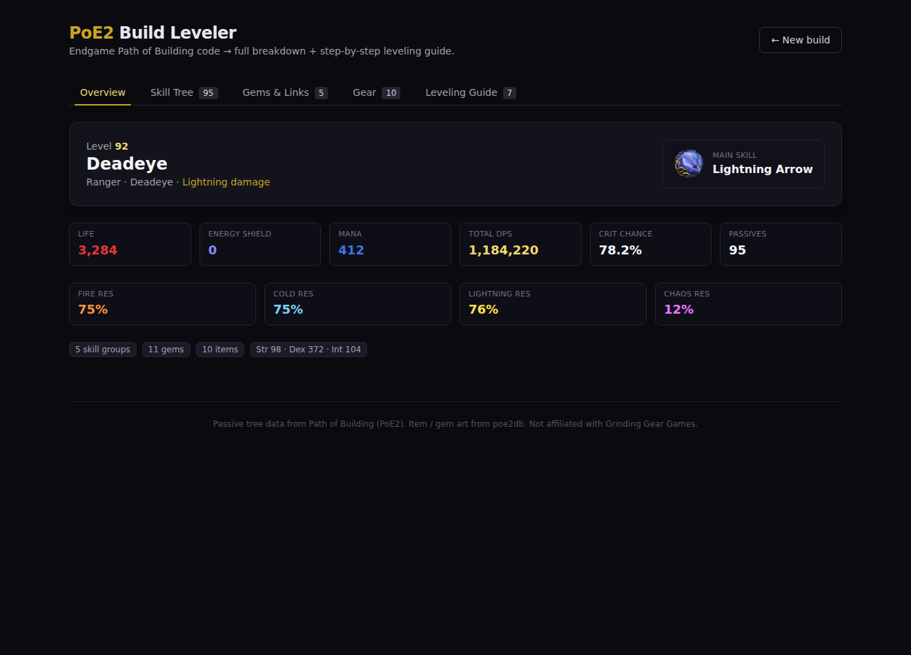
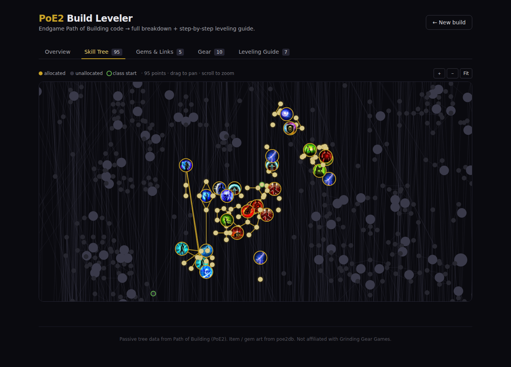
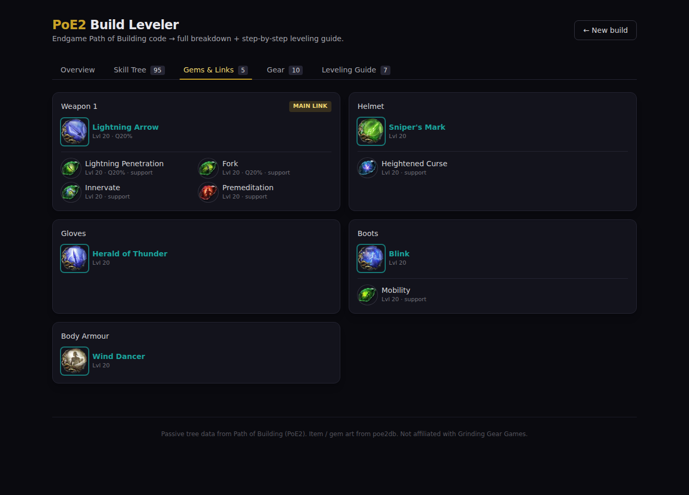
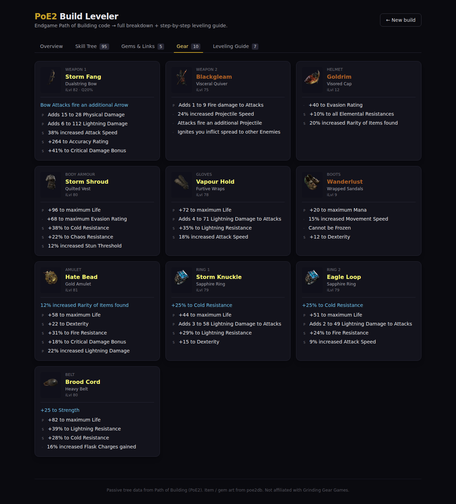
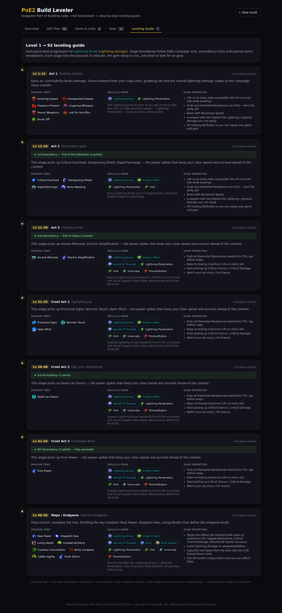

# PoE2 Build Leveler

Paste a **Path of Exile 2** _Path of Building_ export code and get back a full,
image-rich build breakdown **plus an auto-generated, Mobalytics-style level‑1‑to‑endgame
leveling guide**.

The problem this solves: endgame builds (e.g. on poe.ninja) are just finished
snapshots — they don't tell you _how_ to level into them. This tool decodes the
finished build and reconstructs the journey: which passives to take and in what
order, which gems to run at each stage, and what gear to chase.

Everything renders with **real in-game art** — item icons, skill & support gem
icons, and the actual passive **skill tree** with your allocation highlighted —
not just names.

## Screenshots

| Overview | Skill Tree |
| --- | --- |
|  |  |

| Gems & Links | Gear | Leveling Guide |
| --- | --- | --- |
|  |  |  |

## What it does

- **Decodes any PoB (PoE2) code** — URL-safe base64 → zlib → XML → structured build
  (class, ascendancy, level, the full passive tree, every gem, every item).
- **Full build analysis** — overview with stats/resistances, the main skill +
  support links, all gear with parsed implicit/explicit mods.
- **Real images, like Mobalytics** — gem/support icons, item icons (rares by base,
  uniques by name) and passive-node icons, all served through a caching image proxy.
- **Interactive skill tree** — the real PoE2 passive tree rendered on canvas with
  your allocated nodes highlighted, notable icons, pan/zoom and hover tooltips.
- **Smart leveling guide** — the journey is split into stages at meaningful
  breakpoints (campaign acts, ascendancy trials, passive-point budget). Each stage
  lists the passives to allocate (with notable icons), the gem setup to run, gear
  priorities and a short rationale.

Paste a code, a `pobb.in`/`pastebin` link, or just hit **Load example build**.

## How it works

```
PoB code ──► /api/build ──► decode (lib/pob) ──► analysis + leveling (lib/leveling)
                                   │
 passive tree  ──► /api/tree ──────┘  (data/poe2tree.json, positions precomputed)
 art (icons)   ──► /api/icon ─────────► poe2db CDN  (curated map + live resolver, cached)
```

- **`lib/pob/`** — the decoder and parsers (XML → build, item-text → affixes).
- **`lib/tree/`** — slim passive-tree data + undirected adjacency + allocation ordering.
- **`lib/leveling/`** — the staged guide generator (campaign milestones + tree pathing
  + gear/gem heuristics).
- **`lib/images.ts` + `app/api/icon`** — resolve a gem/item/node to real poe2db art,
  with a curated override map (`data/icons.json`) and a disk-cached live resolver,
  served through a proxy so it just works in `` with a graceful fallback tile.
- **`components/SkillTree.tsx`** — canvas renderer for the 4,100-node tree.

## Data sources

- **Passive tree**: [Path of Building (PoE2 fork)](https://github.com/PathOfBuildingCommunity/PathOfBuilding-PoE2)
  `TreeData/0_5/tree.json` (patch 0.5.x — Runes of Aldur) — slimmed and
  position-precomputed by `scripts/prepare_tree.py`. The tree version must track
  the live game, otherwise pasted builds (version-specific node ids) render as
  disconnected nodes.
- **Item / gem / node art**: [poe2db.tw](https://poe2db.tw) CDN.

Not affiliated with Grinding Gear Games.

## Running locally

```bash
npm install
# (optional) refresh the bundled tree data from the PoB PoE2 repo:
python3 scripts/prepare_tree.py
npm run dev          # http://localhost:3000
```

Tech: Next.js 14 (App Router) + TypeScript + Tailwind CSS. PoB decoding uses Node's
built-in `zlib`; no native deps.

## Notes & limitations

- The PoB **copy-item text doesn't label prefix vs suffix**, so affixes are split
  reliably into implicit/explicit and the prefix/suffix tag is a best-effort estimate.
- The leveling logic is **heuristic** (campaign milestones + spatial/graph tree
  pathing). PoE2 gem acquisition depends on Uncut Gem drops/quests, so treat the
  per-stage gem plan as guidance rather than exact timings.
- PoE2 is young and patches often; tree/art data is kept in updatable data files.
